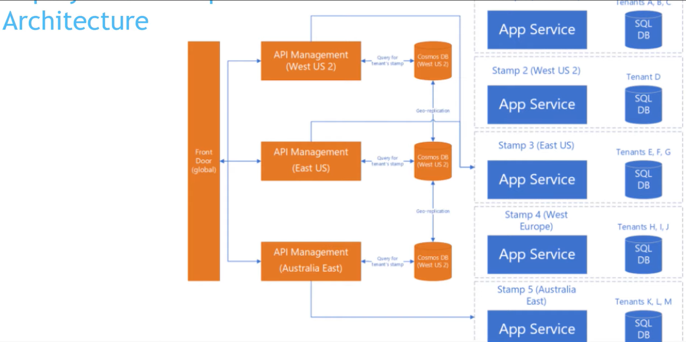

# Cloud Design Patterns

# Overview

Cloud Design Patterns with a focus on Azure.

1. [GateKeeper](#gatekeeper)
2. [Gateway Aggregation](#gateway-aggregation)
3. [Gateway Offloading](#gateway-offloading)
4. [Gateway Routing](#gateway-routing)
5. [Priority Queue](#priority-queue)
6. [Publish Subscribe](#publish-subscribe)
7. [Queue Based Load Leveling](#queue-based-load-leveling)
8. [Asynchronous Request Reply](#asynchronous-request-reply)
9. [Bulkhead](#bulkhead)
10. [Static Content Hosting](#static-content-hosting)
11. [Claim Check](#claim-check)
12. [Ambassador](#ambassador)
13. [Anti Corruption Layer](#anti-corruption-layer)
14. [Strangler Fig](#strangler-fig)
15. [Backends For Frontends](#backends-for-frontends)
16. [Sidecar](#sidecar)
17. [Throttling](#throttling)
18. [Valet Key](#valet-key)
19. [Federated Identity](#federated-identity)
20. [Deployment Stamp](#deployment-stamp)
21. [Geode](#geode)
22. [External Configuration Store](#external-configuration-store)
23. [Choreography](#choreography)
24. [Competing Consumers](#competing-consumers)
25. [Cache Aside](#cache-aside)

## GateKeeper

- the purpose is to have an aditional layer of security in front of application services (OAuth, hide the URL of application services, SSL Offloading)
- can be implemented with Azure API Management (OAuth, transformation policies) and ApplicationGateway(SQLIngection, cross site scripting)
- will add latency and a single point of failure

## Gateway Aggregation

- aggregate multiple individual requests into a single request
- can be implemented with Durable Functions (Fan In Fan Out)
- gateway has to be close to backend services to limit latency
- single point of failure
- performance bottleneck
- implement distributed tracing

### Solution

## Gateway Offloading

- need high availability and scalable

### Problem

### Solution

## Gateway Routing

- protect the client to make changes when backend urls change
- provide a single endpoint for the client
- can be implemented with Azure Front Door or Application Gateway

### Problem

### Solution

## Priority Queue

- can be implemented with Azure Service Bus Queues

### Solution

- some message queues provide support for priority already
  
- this pattern can also be implemented with different queues for each priority
  
- instead of having dedicated consumers, we can have a pool of consumers for all the 3 queues, with the condition that a consumer must consume first from the high priority queues first
  

## Publish Subscribe

- can be implemented with Azure ServiceBus Topics, EventHubs, EventGrid
- need to consider: ordering, poison messages, at least once delivery, message expiration and scheduling

### Problem

### Solution

## Queue Based Load Leveling

- useful to any application that uses services that are subject to overloading
- not to be used if application expects a response from the service with minimal latency

### Solution

## Asynchronous Request Reply

- use this pattern when it is difficult to provide callback endpoints (websockets, webhooks) or because of firewall restrictions on the client side
- don't use it when you can use a service for asynchronous notifications (Event Grid) or responses must stream in realtime to the client
- use HTTP 202 and include Location and Retry-After headers
- should allow for cancellation of a request

### Problem

### Solution

## Bulkhead

- isolate resources used to consume backend services
- isolate critical consumers from standard consumers
- can be implemented using a dedicated pool of resources (ports, threads)
- can be combined with other patterns like circuit breaker
- can be implemented using containers

### Problem

### Solution

## Static Content Hosting

- place static content in storage (Azure Blob, AWS S3) instead of in a compute service to save on cost
- use CDN to better serve clients from different regions than where the storage account is

### Problem

### Solution

## Claim Check

- use when the message size cannot fit the supported message limit of the chosen message bus technology. For example Azure Service Bus has a limit of 256KB - 1 MB per message depending on the tier.
- message will be split into a claim check (samll) and a payload(big) saved into a storage

### Problem

### Solution

## Ambassador

- you need to build a common set of connectivity features for multiple microservices, languages, frameworks
- avoid breaking the DRY principle
- should allow clients to pass some context to the ambassador, like max number of retries

### Problem

### Solution

## Anti Corruption Layer

- allows to perform a multi stage migration from a legacy system to a new system

### Problem

### Solution

## Strangler Fig

- gradually migrate a back-end application to a new architecture, without affecting the website

### Problem

### Solution

- can be combined with Anti Corruption Layer

## Backends For Frontends

- create separate backend services to be consumed by specific frontend applications

### Problem

### Solution

## Sidecar

- isolate in a different process some common functionality (log, configuration, proxy)
- used when having different technologies in the main applications, then the sidecar can offer these features

### Problem

### Solution

## Throttling

- control the consumption of resources used by the application
- can be implemented with Azure API Management

## Valet Key

- to minimize resource loading and maximize performance and scalability
- to minimize operational cost

### Problem

### Solution

## Federated Identity

- delegate authentication to an external identity provider
- simplify user management
- can use Azure Active Directory, Google, Facebook, etc
- allows to implement SSO
- an external identity provider can also help with RBAC for more granular control

### Problem

### Solution

## Deployment Stamp

- solves the challange of deploying multiple independent copies of application components, including data stores
- each individual copy is called **Stamp**
- redirection can be done with AzureFrontDoor
- use it when you have a natural limit on scalability (ex: SQL Server)
- use it when there is a requirement to separate certain clients from others
- there can be a higher cost when using many stamps
- allows a better resilience during outages
- do not use if data needs to be replicated across all deployed instances (Geodes pattern)

### Solution

## Geode

- deploying a collection of backend services into a set of geographical nodes, each of which can service a request for any client in any region
- can be implemented with a CosmosDB database which will be geo replicated in multiple regions
- use Azure Fron Door to direct users to the closest region

### Problem

### Solution

## External Configuration Store

- move the configuration information out of the application deployment package to a centrelized location
- consider schema of the storage (key value pair or something more complex like a document based)

### Problem

### Solution

## Choreography

- have each component of the system to participate in the decision-making process about the workflow of a businesss transcation instead of replying on a central point of control.
- if one service fails to complete a business operation, it can be difficult to recover from that failure.
- this pattern becomes a challange if the number of services grow rapidly

### Problem

### Solution

## Competing Consumers

- enable multiple concurrent consumers to process messages received on the same messaging channel

### Solution

## Cache Aside

- load data _on demand_ into a chache from a data store, while keeping the _consistency_ between the data held in the cache and the data store.

### Problem

### Solution

### Other caching systems

- Read-through
  

- Write-through
  

- Write-behind
  

## References

[30 Cloud Design Patterns in depth](https://www.youtube.com/watch?v=cxYHugyNTP0)
