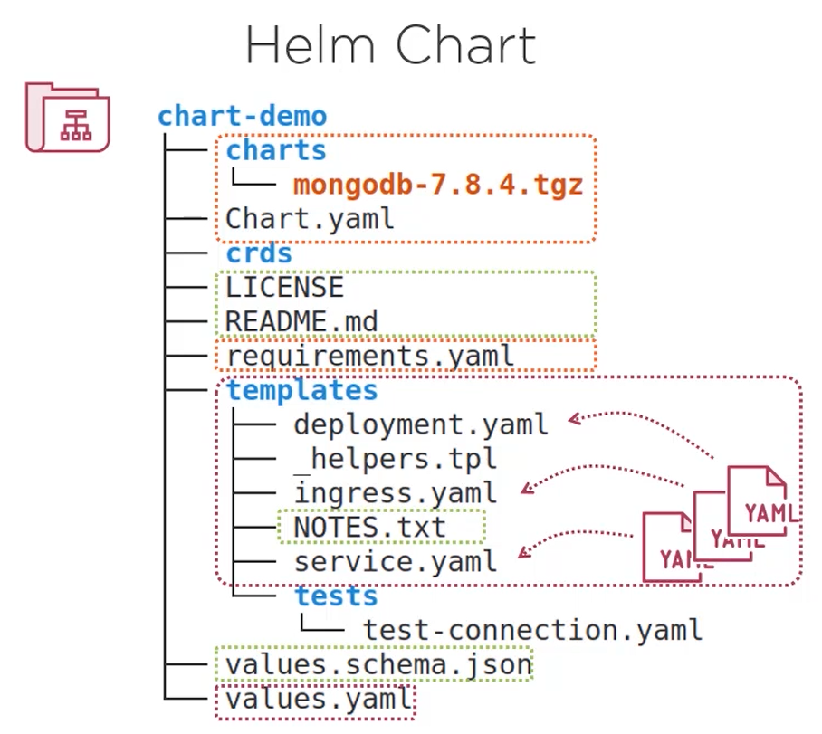
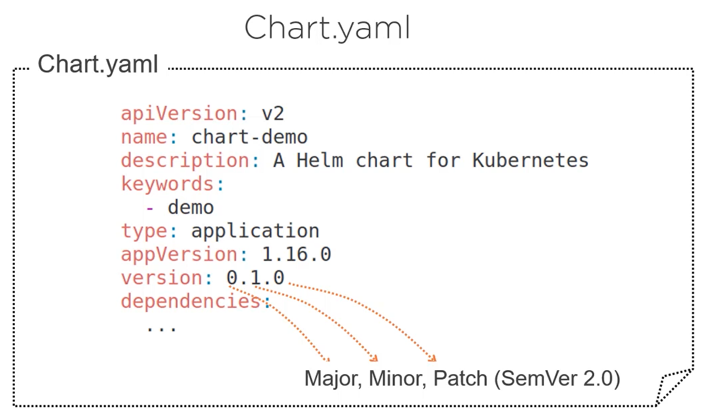
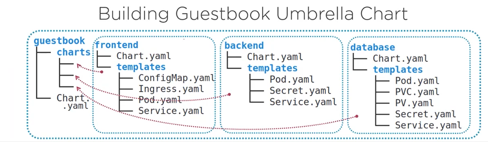
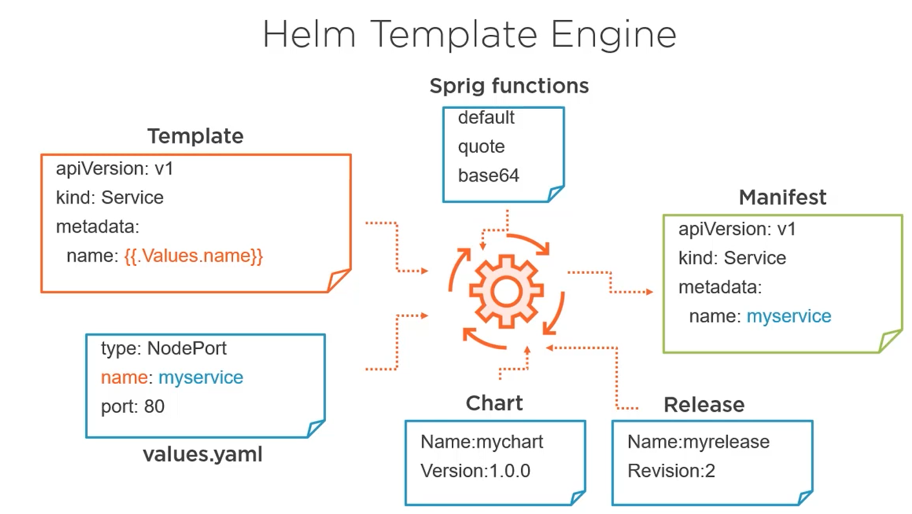

## Helm Overview
- samples can be found on [GitHub](https://github.com/phcollignon/helm3)
- helm client is used to intall helm *charts*
- an installation of a *chart* in the cluster is called a *release*
- when a change is done in a chart (one of the existing files), you do not need a new release. you can apply the change to the same release and a new *revision* will be created
- a *revision* should not be confused with a *chartVersion* which should be increased when the chart structure changes (new files added, etc)
- *appVersion* refers to the version of the application being packeged
- you can install multiple releases of the same chart. The name of the resource in the cluster namespace must be unique, that is why generally the name of the release is included in the resource name. Ex: *name: {{ .Release.Name}}-{{ .Chart.Name }}-config*
- the helm releases are stored in K8S as *secrets* per namespace
- it is possible to update a k8s resource with kubectl and not the helm. In this case, helm will apply a three-way merge patches update, by merging the new chart with the live state of the resource in the cluster
- helm2 uses Tiller to communicate with k82 api.
- you can use a JSON schema file for the values file to enforce that the format is correct

```
helm repo add stable [repository-url]
helm install [release] [chart]
helm install [release] [chart] --dry-run --debug 2>&1 | less
helm upgrade [release] [chart]
helm rollback [release] [revision]
helm history [release]
helm status [release]
helm get all [release]
helm uninstall [release]
helm list
helm get manifest [release]

#show the name of releases
kubectl get secret | grep [release-name]

helm package [chart]
helm dependency list [chart]
```





## Helm Template 

- data in a template can come from {{.Values}}, {{.Chart}}, {{.Release}}
- you can use *global* property to access its value from a parent or a child chart. Ex: appId: {{.Values.global.id}}
- functions and pipeline. Ex: *quote value* vs *value | quote*
- functions: default default_value, quote, upper, trunc 63, trimSuffix "-", b64enc, randAlphaNum 10, toYaml, printf, empty, list value ... | join "-", indent
- logical operators (eq, ne,ft, lt, or, and, not) are expressed as functions. Ex: *eq .Val1 .Val2*
- flow control: if / else, range
- helper functions are stored in _helpers.tpl
```
# definition in _helpers.tpl file
{{- define "backend.fullname" -}}
{{.Release.Name}}-{{ .Chart.Name}}
{{- end -}}

# usage in a template
kind: Deployment
metadata:
  name: {{ include "backend.fullname" . }}
```
- NOTES.txt is used to include some documentation for the chart. It is also evaluated by the template engine
- you can controll dependencies of a chart using *condition* and *tags*

