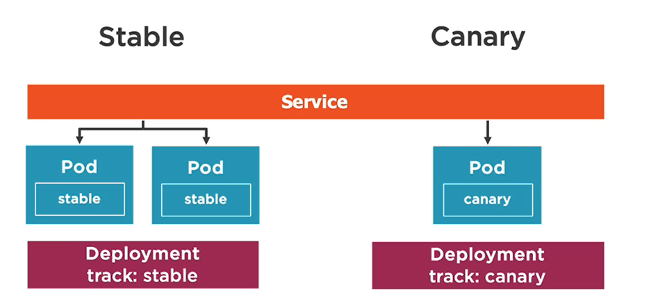

## Kubernetes Overview
* key kubernetes features
    - service discovery / load balancing
    - storage orchestration
    - automate rollouts / rollbacks (zero downtime deployment)
    - self healing
    - secret and configuration management
    - horizontal scalling
* kubernetes building blocks
    - Container
    - Pod
    - Deployment / ReplicaSet
    - Service
* kubernetes architecture components on master node
    - etcd
    - api server
    - controller manager
    - scheduller
* kubernetes architecture components on worker nodes
    - kubelet
    - container runtime
    - kube-proxy

* kubectl commands
```
kubectl cluster-info
kubeclt get all
// run a pod
kubectl run [container-name] --image=[imagename]
// forward port host:container
kubectl port-forward [pod] [ports]
//create
kubectl create [resource] --save-config
// create or update
kubectl apply [resource]

kubectl create -f pod.yml --dry-run
kubectl describe ...
kubectl delete ...
```
## Pods
- a pod can contain multiple containers (aka side container)
 - each pod has an IP address (ClusterIP) and is accesable only from inside the cluster
 - yaml contains maps and lists
 - containers should have livenessProbe (when should a container restart) and readinessProbe (when should a container start receiving traffic).  We can use a exec, httpGet or tcpSocket action for the check.
 ```yaml
 spec:
  containers:
  - name: my-nginx
    image: nginx:alpine
    livenessProbe:
      httpGet:
        path: /index.html
        port: 80
      initialDelaySeconds: 15
      timeoutSeconds: 2
      periodSeconds: 5
      failureThreshold: 1
 ```

## Deployments / ReplicaSet
- ensure pods stay running and can be used to scale pods
- a deployment wraps replicasets which are created behind the scenes
- a deployment yaml contains a *replicas* to indicate the desired number of instances, a *selector* to indicate which pod to deploy, *template* to create the pods
- it is important to have resource limits (memory, cpu) set up

```
kubectl get deployment --show-labels
kubectl get deployment -l app=nginx
```

## Services
- a service provides a single point of entry for accessing one or more pods
- a service load balances between pods
- a service relies on labels to associate a service with a pod
- Service Types
    - ClusterIP (default) - cannot be access from outside the cluster
    - NodePort - exposes a port from the worker node where the pod is wronning. A *nodePort* can be defined too
    - LoadBalancer - useful when combined with a cloud provider
    - ExternalName - allows to call an external service from inside the cluster
- a service yaml contains a *type*, *selector* and *ports* (port and targetPort)
- using metadata -> name, we could use that to access a service. Ex: backend:port

```
\\ test if we can access a pod from another pod
kubectl exec [pod-name] -- curl -s http://podIP
```

## Storage
- a volume can be used to hold data and state for pods and containers
- a *volumeMounts* references a *volumes* by name and defines a *mountPath*
- volume types:
    - emptyDir: empty directory for storing transient data (shares a pod's lifetime). Useful for sharing files between containers running in a pod
    - hostPath - pod mounts into the node's file system (type: Socket, Directory, File, etc)
    - nfs - a network file system share mounted into the pod
    - configMap / secret
    - persistentVolumeClaim
    - Cloud: azureDisk, azureFile, awsElasticBlockStore, etc
- in a pod yaml, you describe the *volumes* with it's type and then in a container you *volumeMounts* that volume using its *name* and the *mountPath*

- a *PersistentVolume* is a cluster-wide storage unit provisioned by an administrator manually with a lifecycle independent from a Pod
- a *PersistentVolumeClaim* is a request for a storage unit (PV)
- see https://github.com/kubernetes/examples for examples
- a *StorageClass* is a type of storage template that can be used to dynamically provision storage (PV)
- in yaml, both the PV and PVS will use *storageClassName* to reference that
- you can use a storage class that provisions volumes locally (see provisioner: kubernetes.io/no-provisioner). Then in PV we can reference that SC and use a *local* folder from the host
- CSI (Container Storage Interface) - an abstration to allow storage vendors to manage on their end the storage details. It is basically the plugin system that allows kubernetes to use any kind of storage.
- block volumes do not support ReadWriteMany *accessModes*. file based volumes (NFS, etc) do.
- *persistentVolumeReclaimPolicy*: Retain (PV is kept, but cannont be claimed by other pods), Delete (depends on provider, but it can delete the PV in kubernetes and the storage in the provider)
- *volumeBindingMode* in *StorageClass*: WaitForFirstConsumer, so that the storage is created in the same region as the pod needing that volume
- containers inside a pod can have access to the same PV / PVC, but different pods cannot share the same PV/PVC

## ConfigMaps
- a configmap can store entire files or provide key/value pairs
- a configmap can be accessed from a pod using env variables (key/value) or configmap volume (access as files)
- you can create a configmap from a config file (--from-file) or from an env file (--from-env-file) or --from-literal.

```yaml
kind:ConfigMap
metadata:
  name: app-settings
data:
  enemies: aliens
  lives: "3"  
```

```yaml
kind:ConfigMap
metadata:
  name: app-settings
data:
  # file name is the key
  game.config: |-
  enemies: aliens
  lives: "3"  
```

```yaml
spec:
  containers: ...

  # this will load one specific entry from data as env variable
  env:
  - name: ENEMIES
    valueFrom:
      configMapKeyRef:
        name:app-settings
        key: enemies

  # this will load all entries from data as env variable
  envFrom:
  - configMapRef:
    name: app-settings
```

// the data will be accessable as 2 files enemies and lives in /etc/config.
```yaml
spec:
  volumes:
  - name: app-config-vol
    configMap:
      name: app-settings
  containers:
    volumeMounts:
      - name: app-config-vol
        mountPath: /etc/config
```

## Secrets
- Best practices:
  - enable encryption at rest for cluster data
  - limit access to etcd (where secrets are stored) to only admin users
  - use SSL / TLS for etcd peer-to-peer communication
  - manifest (yaml, json) files only base 64 encode the secret. So having a secret in a declarative yaml is not secure if that file is checked in source control
  - pods can access secrets, so secure which users can create pods. RBAC can be used

  ```
  kubectl create secret generic my-secret --from-literal=pwd=my-password
  kubectl create secret generic my-secret --from-file=ssh-privatekey=~/.ssh/id_rsa
  ```

## Troubleshooting
  ```
  # view logs of a container in the pod
  kubectl logs [pod-name] -c [container-name]

  # view the logs from a previously running pod
  kubectl logs -p [pod-name]

  # stream a pod's logs
  kubeclt logs -f [pod-name]

  # describe a pod. it includes events
  kubectl describe pod [pod-name]
  kubectl get pod [pod-name] -o yaml

  # shell into a pod container
  kubeclt exec [pod-name] -it sh

  # get details about the properties of a pod object in general (probes, afinities, restart policy etc)
  kubectl explain pods --recursive
  kubectl explain pod.spec.initContainers

  kubectl get pods --watch

  kubectl top nodes
  kubectk top pods
  ```

  - *Metrics Server* is a cluster-wide aggregator of resource usage data. Commands like *kubectl top* or Horizontal Pod Autoscaler use metrics server. The metrics-server stores the latest values only.
  - *kube-state-metrics* is a simple service that listens to the kubernetes api server and generates metrics about the state of the objects: node status, node capacity (CPU and memory), number of desired/available/unavailable/updated replicas per Deployment, pod status (e.g., waiting, running, ready), and so on

## Multi container patterns

- allows to keep single responsability principle, where helper logic gets implemented in a different container

### Init Pattern
  - starts before the app container
  - runs only once
  - examples: init container might pull some html code from git, locally, that the main app then will use
  - they are defined in yaml in *pod.spec.initContainers*
  - if multiple init containers, they run in seququence
  - their code has to be idempotent because the might be executed multiple times on restarts

### Sidecar Pattern
 - starts with app container and runs concurrently for long term
 - service meshes are using sidecar pattern to perform task like reporting telemetry, etc

### Adapter Pattern
 - a specialized version of side car pattern
 - example: an adapter container reads custom metrics and exposed them as prometheus standard metrics to be scraped.

### Ambasador Pattern
 - a specialized version of side car pattern
 - example: an ambasador container could proxy requests from the main container to the outside world

## Service Accounts
- in kubernetes we have *Users* (managed outside K8S) and *Applications* (Service Accounts managed inside K8S)
- the requests to the cluster (comming from kubectl or the pods/hpa/etc in the cluster) go to the *K8S api* and are authenticated and authorized
- on every namespace there is a *default* serviceAccount that gets attached to a pod/hpa/etc if no serviceAccount is specified
- each sa has a *service-account-token* associated
- a *Role* defines what operations are allowed in a namespace. For example [get, watch, list] [services]
```
kind: Role
metadata:
  namespace: default
  name: svc-ro
rules:
- apiGouprs: [""]
  resources: ["services"]
  verbs: ["get", "watch", "list"]
```
- a *RoleBinding* attaches that role to a service account.
```
kind: RoleBinding
metadata:
  namespace: default
  name: svc-ro  
subjects:
- kind ServiceAccount
  name: "service-reader"
  namespace: default
roleRef:
  kind: Role
  name: svc-ro
  apiGroup: rbac.authorization.k8s.io
```
- then a service account can be created
```
kubectl create serviceaccount service-reader
```

## Kubernetes Deployments Overview

### Rolling Update Deployment
 - allow Deployments' update to take place with zero downtime by incrementally updating Pods instances with new ones
 - this is the default strategy

### Canary Deployment
- allows deploying a new version of the application, side by side with a baseline version, but route only a small percentage of requests to the canari version

- we have a Deployment yaml for the stable with mutiple replicas and a Deployment with 1 replica for the canari version, but both will have the same label which will be used by the Service to select the pods where it will route trafic. Since canary has only one pod, it will be hit less than the stable pods.

### Blue-Green Deployment
- requires two identical hardware environments that are configured exactly the same way. While one env is active and servers end users, the other env remains idle for testing.
- pay attention that you need more infrastructure to run 2 production envs.

- when testing is done, the public service can be modified to route traffic to green version

## Jobs
- a Job creates one or more pods and ensures that a specified number of them successfully terminate
- Job can be configured to run multiple pods in parallel
- once a job is deleted, its Pods are removed
- a CronJob is a Job that runs on a scheduled basis
- a Job has a *restartPolicy* (Never, OnFailure) and a *command*
- a Job has *completitions* (how many pods must complete successfully) amd *parallelism* (how many pods to run in parallel)
- a CronJob has a *concurrencyPolicy* (allow multiple pods to run event if their schedulling overlaps) and a *schedule* 
