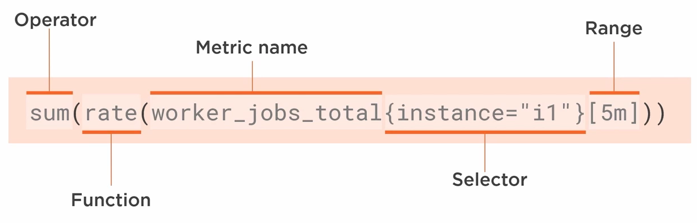

## Prometheus Overview
- format is *metric-name value* or *metric-name{label} value*, Ex:
```
# HELP node_disk_io_time_seconds_total Total seconds spend doing I/Os.
# TYPE node_disk_io_time_seconds_total counter
node_disk_io_time_seconds_total{device="sda"} 104.296

# TYPE node_cpu_seconds_total counter
node_cpu_seconds_total{cpu="0",mode="idle"} 1800
node_cpu_seconds_total{cpu="1",mode="idle"} 1400
```
-labels and how many values they can store have an impact on the number of timeseries to be stored

## Metric types

- a *counter* always increases (number of http requests)
- a *gauge* is a snapshot of a changing value (number of memory allocated bytes)
- a *summary* contains 2 values to give an average.
```
calculation_seconds_count 3 
calculation_seconds_sum 16
```
- a *histogram* records data in buckets
```
calculation_seconds_bucket{le="1"} 0
calculation_seconds_bucket{le="5"} 3
calculation_seconds_bucket{le="10"} 6
calculation_seconds_bucket{le="20"} 10
```

## Running and configuring Prometheus
- Prometheus uses a *scrape interval* to scrape *targets* defined in prometheus.yml
- Prometheus can use 
    - *static_configs* to define the targets
    - *file_sd_configs* (file service discovery) to automatically load the targets from a json file
    - *dns_sd_configs*
    - kubernetes. You can use the labels to select which resources to scrape. Ex: (env=test)
- when Prometheus scrapes a target it adds 2 labels itself: *instance* and *job*

- you can also filter, enrich and relabel a label (*relabel_configs*, *metric_relabel_configs*). For example, you can add the *os* label. Note that there is a performance hit when using relabeling since it acts on every metric
```
- job_name: 'web'
  static_configs:
    - targets: ['machine:8080']
      labels:
        os: windows
        runtime: docker
```

## PromQL


```
# filter by label
worker_jobs_active{job="batch", instance=~"i.*"}

# last 3 minutes
worker_jobs_active[3m]

# aggregation
sum(worker_jobs_active)

# aggregation without a label
sum without(job)(worker_jobs_active)

# difference between 2 values. delta is generally used for gauge metrics
delta(worker_jobs_active[1h])

# increment rate per second. Rate is used with counter metrics
rate(worker_jobs_total[5m])

# average duration of delay over time split by instance
sum without(job, os, runtime) (rate(web_delay_seconds_sum[5m])) / 
sum without(job, os, runtime) (rate(web_delay_seconds_count[5m])) / 

# the 90th percentale for http requests duration
histogram_quantile(0.90, sum without(code, job, method, os, runtime)
(rate(http_request_duration_seconds_bucket{code="200"}[5m])))
```

- Prometheus has API for executing queries
```
http:\\localhost:9090/api/v1/query?  query=worker_jobs_active

http:\\localhost:9090/api/v1/query_range?query=tate(worker_jobs_total[5m])
  &start=1593348299&end=159335790955&step=60
```
