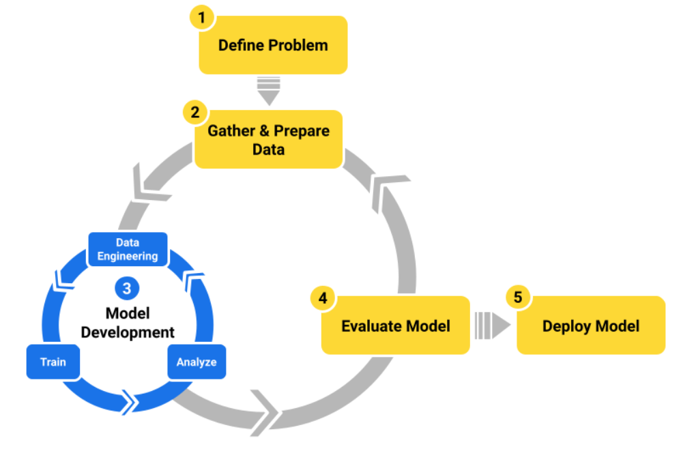

# Auto ML

A simple exploratory ML workflow looks something like this:

Manually training a model involves __repetitive tasks__ (trying different ML algorithms with diferent hyperparameters) and requires __specialized skills__. 

 __AutoML__ as a set of tools and technologies that make building machine learning models faster and more accessible to a wider group of users.

 AutoML Benefits:
 - To save time
 - To improve quality of ML model
 - To build an ML model without needing specialized skills
 - To evaluate a dataset
 - To enforce best practices
 
 AutoML Limitations:
 - Model quality may not be as good as manual training
 - Model search and complexity can be opaque
 - Models can't be customized during training

 AutoML Tools:
 - Tools that require no coding typically take the form of web applications
 - API and CLI tools

 AutoML workflow:
 - Problem definition
 - Data gathering
 - Data preparation (label, clean and format, feature transformations)
 - Model development
    - Import data
    - Analyze data
    - Refine data (semantic checking, transformations)
    - Configure AutoML run parameters
        - Select the ML problem type you plan to solve. For example, are you solving a classification or regression problem?
        - Select which column in your dataset is the label.
        - Select the set of features to use to train the model.
        - Select the set of ML algorithms AutoML considers in the model search.
        - Select the evaluation metric AutoML uses to choose the best model.

- Evaluate model
    - Evaluate your features by examining feature importance metrics.
    - Understand your model by examining the architecture and hyperparameters used to build it.
    - Evaluate top-level model performance with plots and metrics collected during training for the output model.    