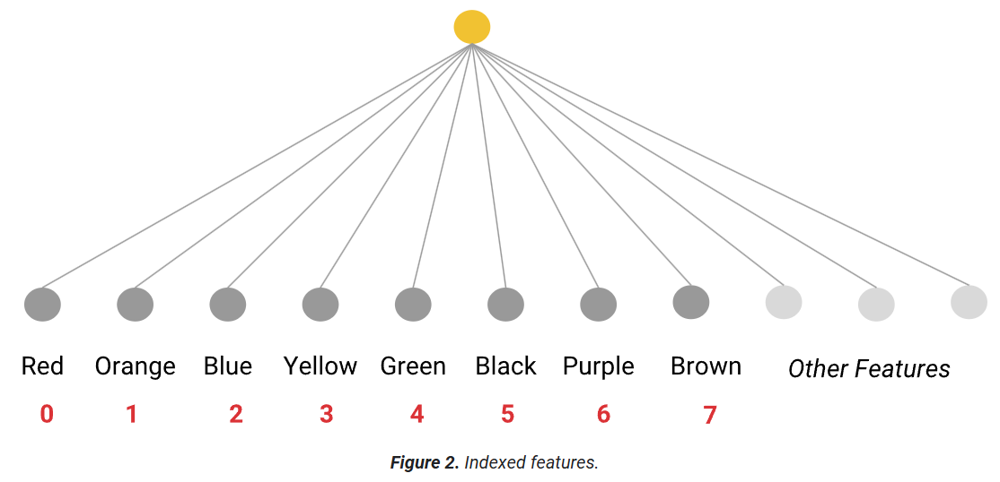
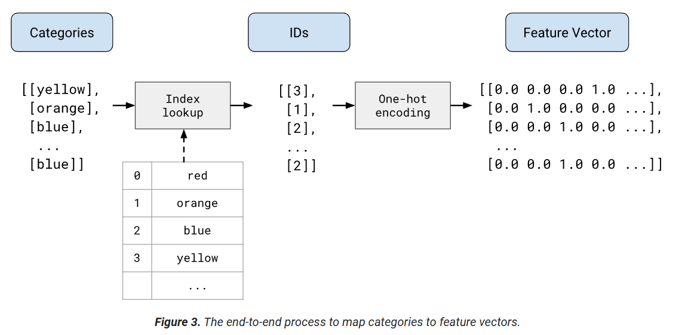

# Categorical data

__Categorical data__ has a specific set of possible values. Numbers can also be categorical data, for example, a postal code. If you represent this feature numerically rather than categorically, you're asking the model to find a numeric relationship between different postal codes. That is, you're telling the model to treat postal code 20004 as twice (or half) as large a signal as postal code 10002. Representing postal codes as categorical data lets the model weight each individual postal code separately.

__Encoding__ means converting categorical or other data to numerical vectors that a model can train on.

In __one-hot encoding__, each category is represented by a vector of N elements, where N is the number of categories. Exactly one of the elements in a one-hot vector has the value 1.0; all the remaining elements have the value 0.0. It is the one-hot vector, not the string or the index number, that gets passed to the feature vector. A feature whose values are predominately zero (or empty) is termed a __sparse feature__. 

Some categorical features have a high number of dimensions, such as us_postal_codes (~ 42K), words_in_english (~ 500k). In these cases, __embeddings__ are a better choice.  Embeddings substantially reduce the number of dimensions, so the model trains faster and inference is also faster.

__Feature crosses__ are created by crossing (taking the Cartesian product of) two or more categorical or bucketed features of the dataset. Like polynomial transforms, feature crosses allow linear models to handle nonlinearities.

For example: _edges_ feature has values :_smooth_, _toothed_ and _lobed_. _arrangement_ feature has values _opposite_ and _alternate_. The feature cross, or Cartesian product, of these two features would be:
{Smooth_Opposite, Smooth_Alternate, Toothed_Opposite, Toothed_Alternate, Lobed_Opposite, Lobed_Alternate}

 A leaf with _smooth_ edges and _opposite_ arrangement is represented as {(1, 0, 0), (1, 0)} and the cross is {1, 0, 0, 0, 0, 0}.