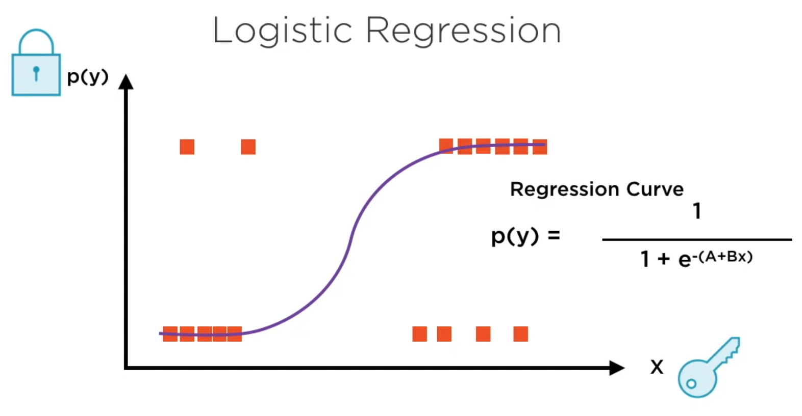
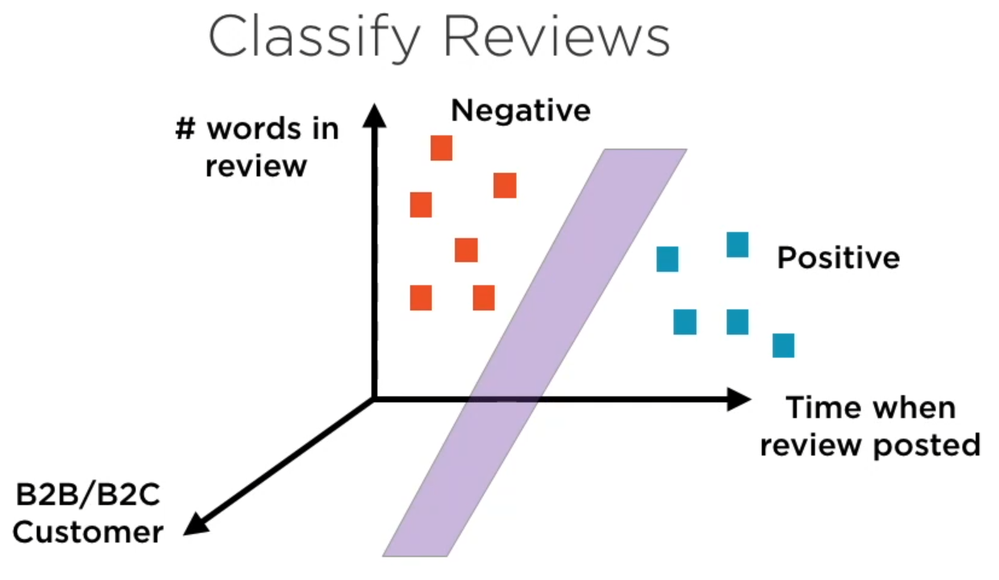
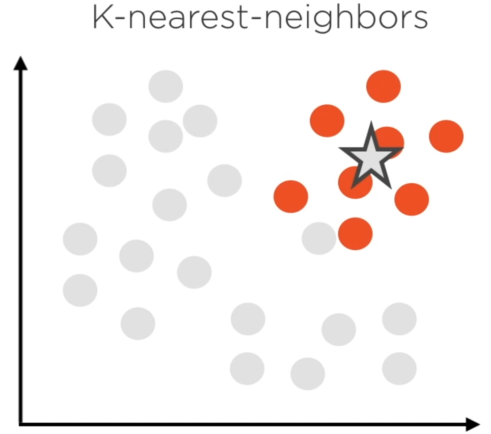
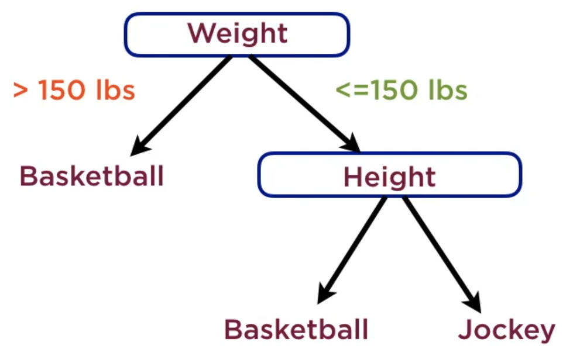
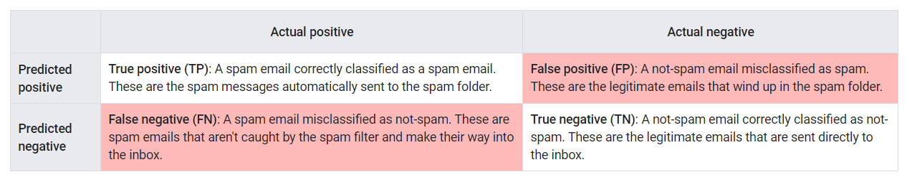
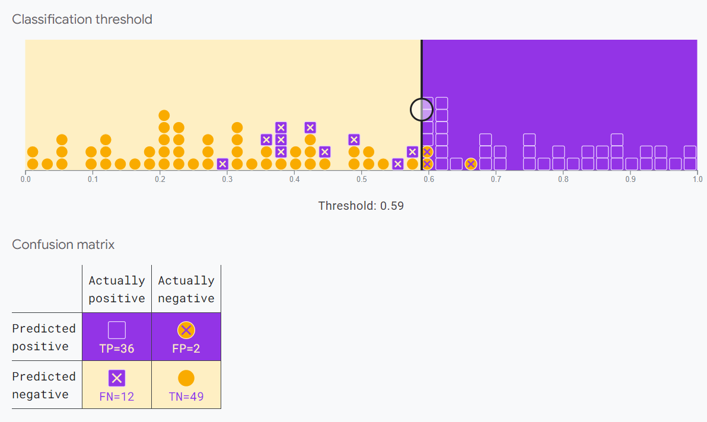
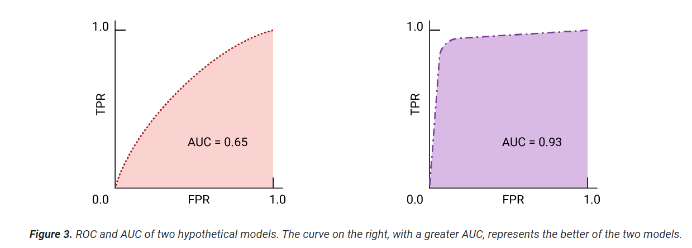

# Classification


__Classification__ is the task of predicting which of a set of classes (categories) an example belongs to. This can be done by converting a logistic regression model that predicts a probability into a binary classification model that predicts one of two classes.
Note that a balanced dataset is important.

## Algorithms
- Logistic Regression
- Support Vector Machines
- Nearest Neighbors (K nearest or Radius nearest)
- Decision Trees
- Naive Bayes
- Random Forest (an ensemble of decision trees in which individual trees are trained on different random subsets of training data)

__Logistic regression__ is similar to linear regression, but instead of fitting a line, it tries to fit a S-curve.


__Support Vector Machines__ uses N-dimensional data represented in a __hypercube__ that is cassified using a __hyperplane__


__Nearest Neighbors__ would look at the k nearest neighbours / radius neighbours to decide if a sample belongs to that category or not


__Decision Trees__ try to fit knowledge into rules. The most important nodes appear at the top of the tree


__Naive Bayes__ algorithm is based on:
- __a priori probabilities__, before anything specific is known. Ex: you need to decide if a person running is a runner or police officer. You know a priori that today there is a marathon. P(Runner) = 9/10, P(Officer) = 1/10
- __conditional probabilities__. Ex: certain items like handcuffs, gun, walkie-talkie are more likely to be observed on a police officer.


## Thresholds and the confusion matrix

A __classification threshold__ between 0 and 1 must be chosen to decide which examples are assigned to the __positive class__ (spam) and to the __negative class__ (not spam).



Notice that the total in each row gives all predicted positives (TP + FP) and all predicted negatives (FN + TN), regardless of validity. The total in each column, meanwhile, gives all real positives (TP + FN) and all real negatives (FP + TN) regardless of model classification.



## Metrics
### Accuracy

$Accuracy = \frac{\text{correct classifications}}{\text{total classifications}} = \frac{TP + TN}{TP + TN + FP + FN}$

### Recall, or true positive rate
$Recall(or TPR) = \frac{\text{correctly classified actual positves}}{\text{all actual positives}} = \frac{TP}{TP + FN}$

### False positive rate
$FPR = \frac{\text{incorrectly classified actual negatives}}{\text{all actual negatives}} = \frac{FP}{FP + TN}$

### Precision
$Precision = \frac{\text{correctly classified actual postives}}{\text{everything classified as positve}} = \frac{TP}{TP + FP}$

### Choice of metric and tradeoffs

| Metric                     | Guidance |
| -------------------------- | ------- |
| Accuracy                   | Use as a rough indicator of model training progress/convergence for balanced datasets.    |
| Recall(True positive rate) | Use when false negatives are more expensive than false positives.     |
| False positive rate        | Use when false positives are more expensive than false negatives.    |
| Precision                  | Use when it's very important for positive predictions to be accurate.    |

## Prediction bias

__Prediction bias__ is the difference between the mean of a model's predictions and the mean of ground-truth labels in the data. A model trained on a dataset where 5% of the emails are spam should predict, on average, that 5% of the emails it classifies are spam.

Prediction bias can be caused by:
- Biases or noise in the data, including biased sampling for the training set
- Too-strong regularization, meaning that the model was oversimplified and lost some necessary complexity
- Bugs in the model training pipeline
- The set of features provided to the model being insufficient for the task

## Multi-class classification

To classify examples with the labels A, B, and C, you could:
- create a binary classifier that categorizes examples using the label __A+B__ and the label __C__
- create a second binary classifier that reclassifies the examples that are labeled __A+B__ using the label __A__ and the label __B__

Example: digit recognitionm with classes from 0 to 9

## Area under the curve (AUC)

The area under the ROC curve (__AUC__) represents the probability that the model, if given a randomly chosen positive and negative example, will rank the positive higher than the negative.

AUC is a useful measure for comparing the performance of two different models, as long as the dataset is roughly balanced.




## Train a model - code sample

- Examine a dataset containing measurements derived from images of two species of Turkish rice.
- Create a binary classifier to sort grains of rice into the two species.
- Evaluate the performance of the model.

```python
# @title Load the imports

import io
import keras
from matplotlib import pyplot as plt
from matplotlib.lines import Line2D
import numpy as np
import pandas as pd
import plotly.express as px

# The following lines adjust the granularity of reporting.
pd.options.display.max_rows = 10
pd.options.display.float_format = "{:.1f}".format

print("Ran the import statements.")

# @title Load the dataset
rice_dataset_raw = pd.read_csv("https://download.mlcc.google.com/mledu-datasets/Rice_Cammeo_Osmancik.csv")

# @title
# Read and provide statistics on the dataset.
rice_dataset = rice_dataset_raw[[
    'Area',
    'Perimeter',
    'Major_Axis_Length',
    'Minor_Axis_Length',
    'Eccentricity',
    'Convex_Area',
    'Extent',
    'Class',
]]

rice_dataset.describe()

# Create five 2D plots of the features against each other, color-coded by class.
for x_axis_data, y_axis_data in [
    ('Area', 'Eccentricity'),
    ('Convex_Area', 'Perimeter'),
    ('Major_Axis_Length', 'Minor_Axis_Length'),
    ('Perimeter', 'Extent'),
    ('Eccentricity', 'Major_Axis_Length'),
]:
  px.scatter(rice_dataset, x=x_axis_data, y=y_axis_data, color='Class').show()

# Plot major and minor axis length and eccentricity, with observations
# color-coded by class.
px.scatter_3d(
    rice_dataset,
    x='Eccentricity',
    y='Area',
    z='Major_Axis_Length',
    color='Class',
).show()

# Normalize data so that features have values in similar ranges of values
# Calculate the Z-scores of each numerical column in the raw data and write
# them into a new DataFrame named df_norm.
feature_mean = rice_dataset.mean(numeric_only=True)
feature_std = rice_dataset.std(numeric_only=True)
numerical_features = rice_dataset.select_dtypes('number').columns
normalized_dataset = (
    rice_dataset[numerical_features] - feature_mean
) / feature_std

# Copy the class to the new dataframe
normalized_dataset['Class'] = rice_dataset['Class']

# Examine some of the values of the normalized training set. Notice that most
# Z-scores fall between -2 and +2.
normalized_dataset.head()

# To make experiments reproducible
keras.utils.set_random_seed(42)

# Create a column setting the Cammeo label to '1' and the Osmancik label to '0'
# then show 10 randomly selected rows.
normalized_dataset['Class_Bool'] = (
    # Returns true if class is Cammeo, and false if class is Osmancik
    normalized_dataset['Class'] == 'Cammeo'
).astype(int)
normalized_dataset.sample(10)

# Create indices at the 80th and 90th percentiles
number_samples = len(normalized_dataset)
index_80th = round(number_samples * 0.8)
index_90th = index_80th + round(number_samples * 0.1)

# Randomize order and split into train, validation, and test with a .8, .1, .1 split
shuffled_dataset = normalized_dataset.sample(frac=1, random_state=100)
train_data = shuffled_dataset.iloc[0:index_80th]
validation_data = shuffled_dataset.iloc[index_80th:index_90th]
test_data = shuffled_dataset.iloc[index_90th:]

# Show the first five rows of the last split
test_data.head()

# prevent the model from getting the label as input during training, which is called label leakage
label_columns = ['Class', 'Class_Bool']

train_features = train_data.drop(columns=label_columns)
train_labels = train_data['Class_Bool'].to_numpy()
validation_features = validation_data.drop(columns=label_columns)
validation_labels = validation_data['Class_Bool'].to_numpy()
test_features = test_data.drop(columns=label_columns)
test_labels = test_data['Class_Bool'].to_numpy()

# Name of the features we'll train our model on.
input_features = [
    'Eccentricity',
    'Major_Axis_Length',
    'Area',
]

# @title Define the functions that create and train a model.

import dataclasses


@dataclasses.dataclass()
class ExperimentSettings:
  """Lists the hyperparameters and input features used to train am model."""

  learning_rate: float
  number_epochs: int
  batch_size: int
  classification_threshold: float
  input_features: list[str]


@dataclasses.dataclass()
class Experiment:
  """Stores the settings used for a training run and the resulting model."""

  name: str
  settings: ExperimentSettings
  model: keras.Model
  epochs: np.ndarray
  metrics_history: keras.callbacks.History

  def get_final_metric_value(self, metric_name: str) -> float:
    """Gets the final value of the given metric for this experiment."""
    if metric_name not in self.metrics_history:
      raise ValueError(
          f'Unknown metric {metric_name}: available metrics are'
          f' {list(self.metrics_history.columns)}'
      )
    return self.metrics_history[metric_name].iloc[-1]


def create_model(
    settings: ExperimentSettings,
    metrics: list[keras.metrics.Metric],
) -> keras.Model:
  """Create and compile a simple classification model."""
  model_inputs = [
      keras.Input(name=feature, shape=(1,))
      for feature in settings.input_features
  ]
  # Use a Concatenate layer to assemble the different inputs into a single
  # tensor which will be given as input to the Dense layer.
  # For example: [input_1[0][0], input_2[0][0]]

  concatenated_inputs = keras.layers.Concatenate()(model_inputs)
  dense = keras.layers.Dense(
      units=1, input_shape=(1,), name='dense_layer', activation=keras.activations.sigmoid
  )
  model_output = dense(concatenated_inputs)
  model = keras.Model(inputs=model_inputs, outputs=model_output)
  # Call the compile method to transform the layers into a model that
  # Keras can execute.  Notice that we're using a different loss
  # function for classification than for regression.
  model.compile(
      optimizer=keras.optimizers.RMSprop(
          settings.learning_rate
      ),
      loss=keras.losses.BinaryCrossentropy(),
      metrics=metrics,
  )
  return model


def train_model(
    experiment_name: str,
    model: keras.Model,
    dataset: pd.DataFrame,
    labels: np.ndarray,
    settings: ExperimentSettings,
) -> Experiment:
  """Feed a dataset into the model in order to train it."""

  # The x parameter of keras.Model.fit can be a list of arrays, where
  # each array contains the data for one feature.
  features = {
      feature_name: np.array(dataset[feature_name])
      for feature_name in settings.input_features
  }

  history = model.fit(
      x=features,
      y=labels,
      batch_size=settings.batch_size,
      epochs=settings.number_epochs,
  )

  return Experiment(
      name=experiment_name,
      settings=settings,
      model=model,
      epochs=history.epoch,
      metrics_history=pd.DataFrame(history.history),
  )


print('Defined the create_model and train_model functions.')

# @title Define the plotting function.
def plot_experiment_metrics(experiment: Experiment, metrics: list[str]):
  """Plot a curve of one or more metrics for different epochs."""
  plt.figure(figsize=(12, 8))

  for metric in metrics:
    plt.plot(
        experiment.epochs, experiment.metrics_history[metric], label=metric
    )

  plt.xlabel("Epoch")
  plt.ylabel("Metric value")
  plt.grid()
  plt.legend()


print("Defined the plot_curve function.")

# Let's define our first experiment settings.
settings = ExperimentSettings(
    learning_rate=0.001,
    number_epochs=60,
    batch_size=100,
    classification_threshold=0.35,
    input_features=input_features,
)

metrics = [
    keras.metrics.BinaryAccuracy(
        name='accuracy', threshold=settings.classification_threshold
    ),
    keras.metrics.Precision(
        name='precision', thresholds=settings.classification_threshold
    ),
    keras.metrics.Recall(
        name='recall', thresholds=settings.classification_threshold
    ),
    keras.metrics.AUC(num_thresholds=100, name='auc'),
]

# Establish the model's topography.
model = create_model(settings, metrics)

# Train the model on the training set.
experiment = train_model(
    'baseline', model, train_features, train_labels, settings
)

# Plot metrics vs. epochs
plot_experiment_metrics(experiment, ['accuracy', 'precision', 'recall'])
plot_experiment_metrics(experiment, ['auc'])

# Evaluate the model against the test set
def evaluate_experiment(
    experiment: Experiment, test_dataset: pd.DataFrame, test_labels: np.array
) -> dict[str, float]:
  features = {
      feature_name: np.array(test_dataset[feature_name])
      for feature_name in experiment.settings.input_features
  }
  return experiment.model.evaluate(
      x=features,
      y=test_labels,
      batch_size=settings.batch_size,
      verbose=0, # Hide progress bar
      return_dict=True,
  )


def compare_train_test(experiment: Experiment, test_metrics: dict[str, float]):
  print('Comparing metrics between train and test:')
  for metric, test_value in test_metrics.items():
    print('------')
    print(f'Train {metric}: {experiment.get_final_metric_value(metric):.4f}')
    print(f'Test {metric}:  {test_value:.4f}')


# Evaluate test metrics
test_metrics = evaluate_experiment(experiment, test_features, test_labels)
compare_train_test(experiment, test_metrics)
```