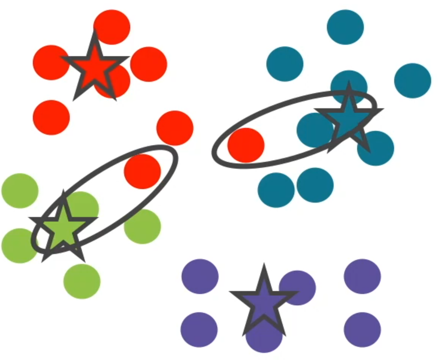
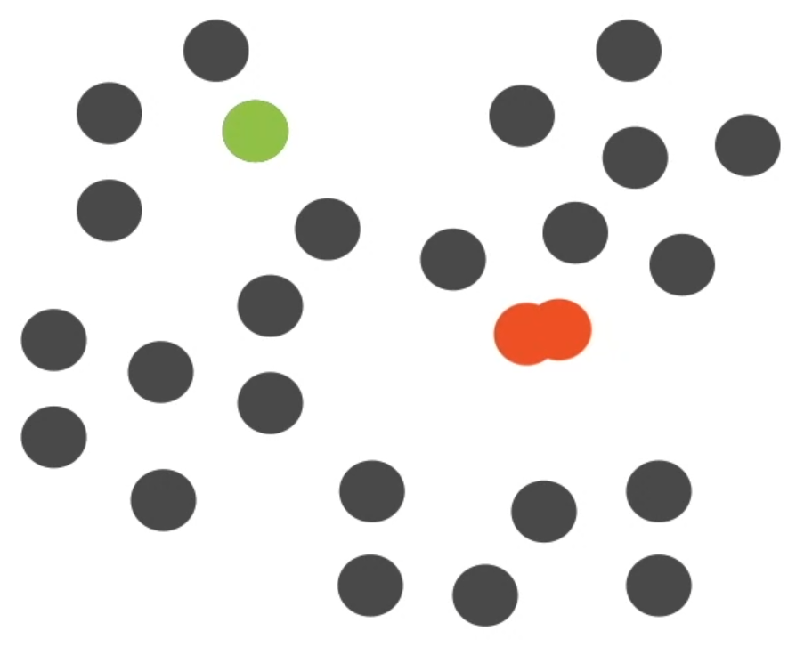

# Clustering

- is a form of unsupervised machine learning
- the distance between users indicates how __similar__ they are
- the distance between users in different clusters should be large and for users in the same clusters should be short

## Types of clustering
- Hierarchical
    - group entities based on their connectivity
    - objects close to each other are more likely to be in the same cluster
    - example: agglomerative

- Centroid-based
    - represent each cluster by a centroid (central vector) which may not be an actual entity at all
    - cluster entities based on the distance from these centroids
    - example: K-Means

- Distribution-based
    - entities that are likely from the same distribution are more likely to be in the same cluster

- Density-based
    - defines clusters based on regions of high density of entities
    - objects in sparse areas are treated as noise

## K-Means

- initilize k points (centroid) in the cluster and assign all the data points to these k clusters based on their distance to the centroids
- recalcualte the mean for each cluster and move certain points to new clusters, if they are now closer to another centroid
- repeat until the centroids are stabilized

## Agglomerative clustering

- start with n clusters, each one having 1 data point
- at every step, find 2 clusters that are the closest toghether and merge them
- stop when you reached the number of clusters desired

