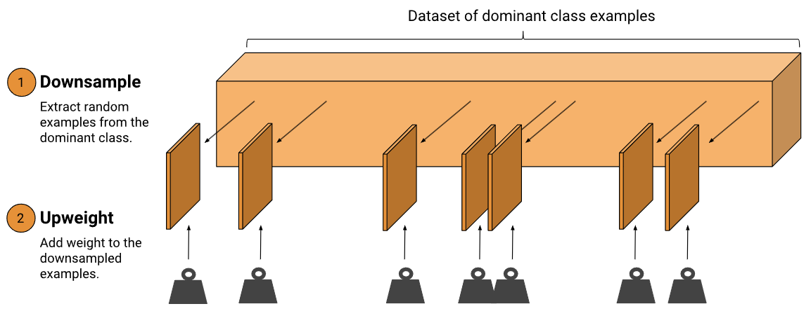
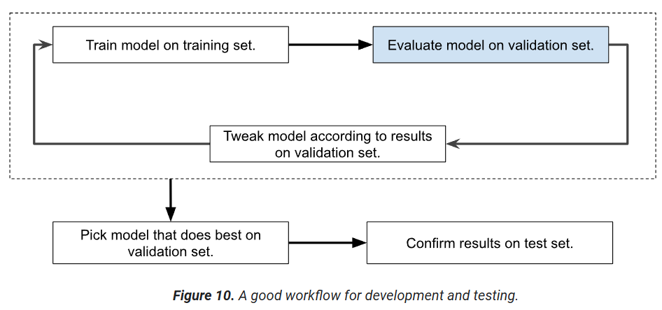
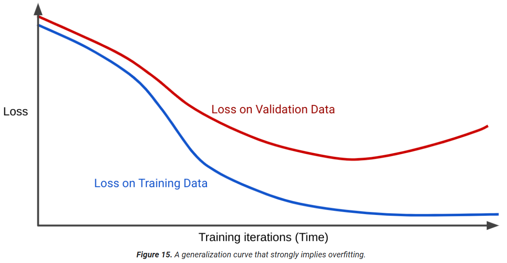

# Datasets, generalization and overfitting

## Labels

- __Direct labels__, which are labels identical to the prediction your model is trying to make. That is, the prediction your model is trying to make is exactly present as a column in your dataset.
- __Proxy labels__, which are labels that are similar—but not identical—to the prediction your model is trying to make

An __imbalanced dataset__ is a dataset where a label is more common than the others. The predominant label in an imbalanced dataset is called the __majority class__; the less common label is called the __minority class__.

One way to handle an imbalanced dataset is to __downsample__ and __upweight__ the majority class.
- Downsampling means training on a disproportionately low subset of the majority class examples
- Upweighting means adding an example weight to the downsampled class equal to the factor by which you downsampled.

The combination of upweighting and downsampling enables __mini-batches__ to contain enough minority classes to train an effective model.

The term weight doesn't refer to model parameters (like, w1 or w2). Here, weight refers to example weights, which increases the importance of an individual example during training. An example weight of 10 means the model treats the example as 10 times as important (when computing loss) than it would an example of weight 1.

## Divide the original data set

Split into: training set, validation set and test set.

## Overfitting

__Overfitting__ means creating a model that matches (memorizes) the training set so closely that the model fails to make correct predictions on new data. An overfit model is analogous to an invention that performs well in the lab but is worthless in the real world.

__Generalization__ is the opposite of overfitting. That is, a model that generalizes well makes good predictions on new data

If the loss curve on tranning and validation dataset are different, this suggests overfitting.

Training a model that generalizes well implies the following dataset conditions:
- Examples must be independently and identically distributed, which is a fancy way of saying that your examples can't influence each other.
- The dataset is stationary, meaning the dataset doesn't change significantly over time.
- The dataset partitions have the same distribution. That is, the examples in the training set are statistically similar to the examples in the validation set, test set, and real-world data.

A model that is too complex might overfit data. The a good model __minimizes loss and complexity__.
)ne approach to keeping a model simple is to penalize complex models; that is, to force the model to become simpler during training. Penalizing complex models is one form of __regularization__.

L2 regularization encourages weights toward 0, but never pushes weights all the way to zero.
$L_2 regularization = w_1^2 + w_2^2 + ... + w_n^2$

$minimize(loss + \lambda complexity)

A high regularization rate reduces the chances of overfitting.

__Early stopping__ is a regularization method that doesn't involve a calculation of complexity. Instead, early stopping simply means ending training before the model fully converges.

__Learning rate__ and __regularization rate__ tend to pull weights in opposite directions. A high learning rate often pulls weights away from zero; a high regularization rate pulls weights towards zero. The goal is to find the equilibrium between learning rate and regularization rate.

