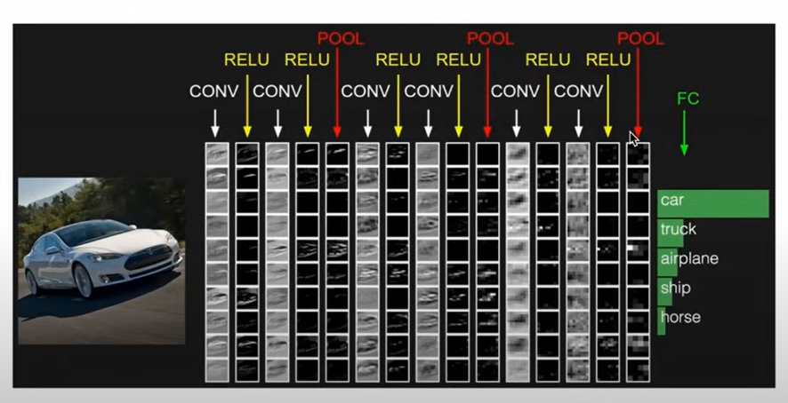
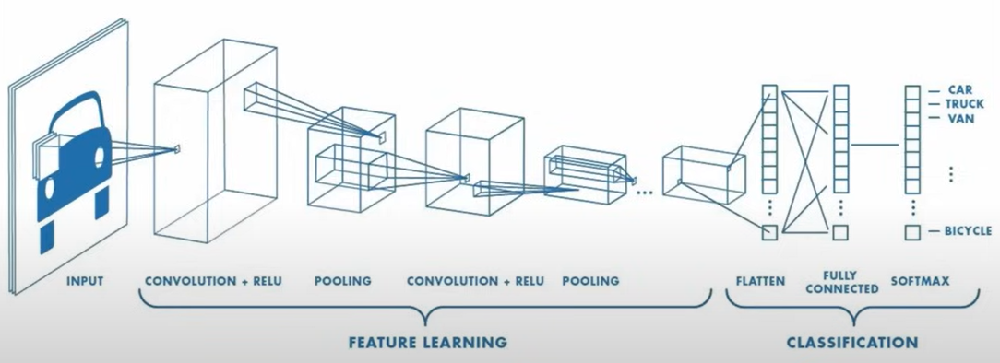
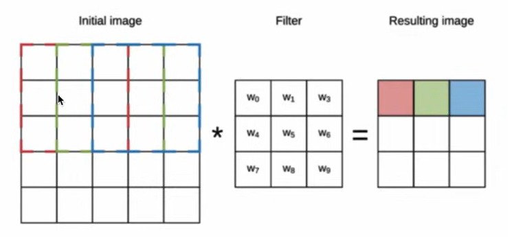
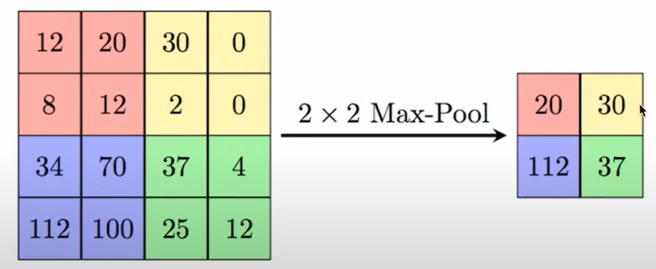
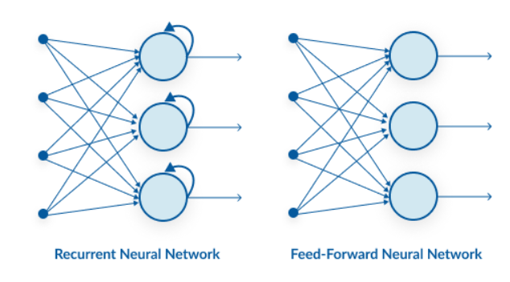
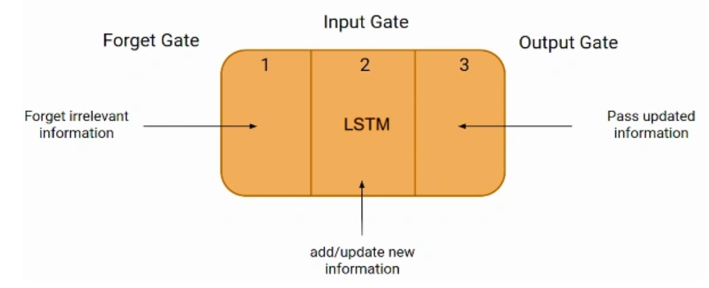

# Deep learning

## Convolutional Neural Networks (CNN)

- architecture used in image clasification and object recognition
- it is composed of 3 types of layers:
    - Convolutional layer
    
    - Pooling layer
    
    - Fully-connected layer

## Recurrent Neural Networks (RNN)

### Advantages of RNNs:
- Handle sequential data effectively, including text, speech, and time series.
- Process inputs of any length, unlike feedforward neural networks.
- Share weights across time steps, enhancing training efficiency.

### Disadvantages of RNNs:
- Prone to vanishing and exploding gradient problems, hindering learning. Fixed by LSTM
- Training can be challenging, especially for long sequences.
- Computationally slower than other neural network architectures.

### RNN vs FNN

#### Information Flow
__FNNs__: A feed-forward neural network has only one route of information flow: from the input layer to the output layer, passing through the hidden layers. The data flows across the network in a straight route, never going through the same node twice. A feed-forward neural network can perform simple classification, regression, or recognition tasks but can’t remember the previous input it has processed. That’s why FNNs have poor predictions of what will happen next; they have no memory of the information they receive. Because it simply analyses the current input, a feed-forward network has no idea of temporal order. Apart from its training, it has no memory of what transpired.

__RNNs__: The information is in an RNN cycle via a loop. Before making a judgment, it evaluates the current input and what it has learned from past inputs. A recurrent neural network, on the other hand, may recall due to internal memory. It produces output, copies it, and returns it to the network.

#### Data Type
__FNNs__: Typically work best with fixed-length inputs and outputs. They excel at pattern recognition tasks where the data points are independent of each other. For instance, image recognition or spam email classification.

__RNNs__: Shine in handling sequential data, where the order and relationships between elements matter. This makes them ideal for tasks like speech recognition, machine translation, and text generation where the meaning unfolds over time.

#### Application
__FNNs__: Power applications like image recognition, medical diagnosis (analyzing X-rays to detect abnormalities), image classification and spam filtering (identifying unwanted emails).

__RNNs__: Drive tasks like speech recognition (understanding spoken language), machine translation (converting text from one language to another), text generation (creating chatbots or writing different content formats), and time series forecasting (predicting stock prices or weather patterns).

###  Long Short-Term Memory (LSTM)

Long Short-Term Memory Networks or LSTM in deep learning, is a sequential neural network that allows information to persist. It is a special type of Recurrent Neural Network which is capable of handling the vanishing gradient problem faced by RNN.

The first part chooses whether the information coming from the previous timestamp is to be remembered or is irrelevant and can be forgotten. In the second part, the cell tries to learn new information from the input to this cell. At last, in the third part, the cell passes the updated information from the current timestamp to the next timestamp. This one cycle of LSTM is considered a single-time step.

These three parts of an LSTM unit are known as gates. They control the flow of information in and out of the memory cell or lstm cell. The first gate is called Forget gate, the second gate is known as the Input gate, and the last one is the Output gate. An LSTM unit that consists of these three gates and a memory cell or lstm cell can be considered as a layer of neurons in traditional feedforward neural network, with each neuron having a hidden layer and a current state.

