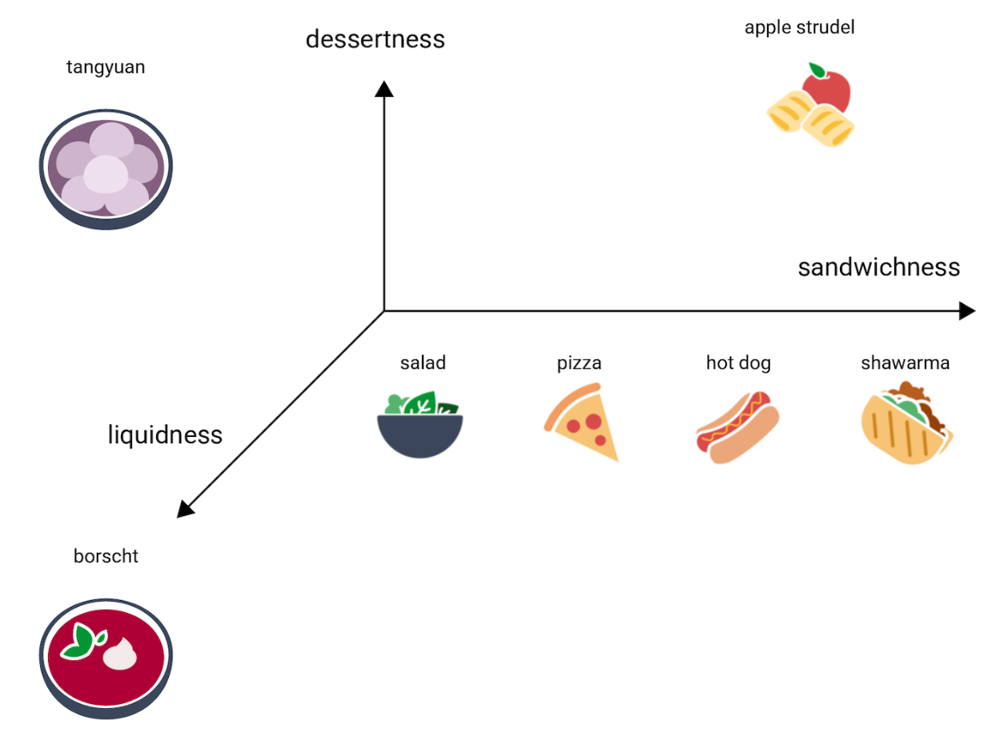
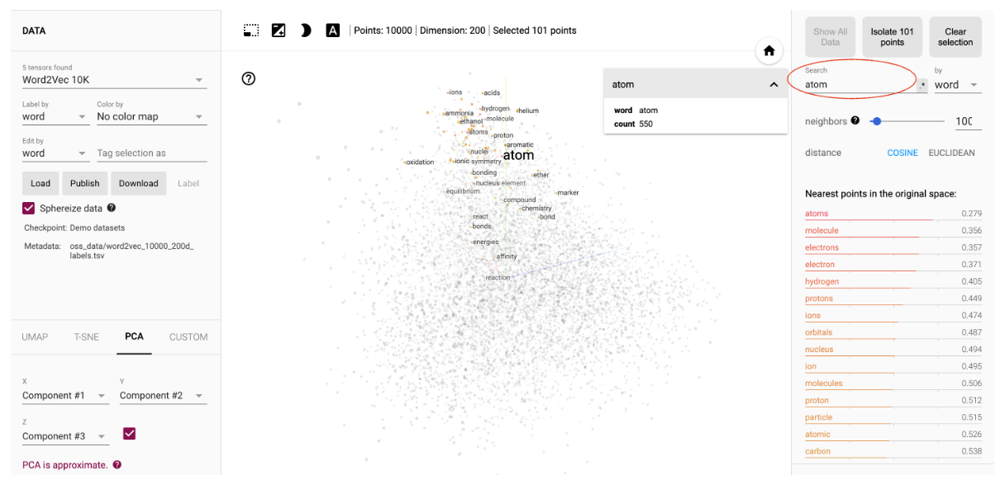
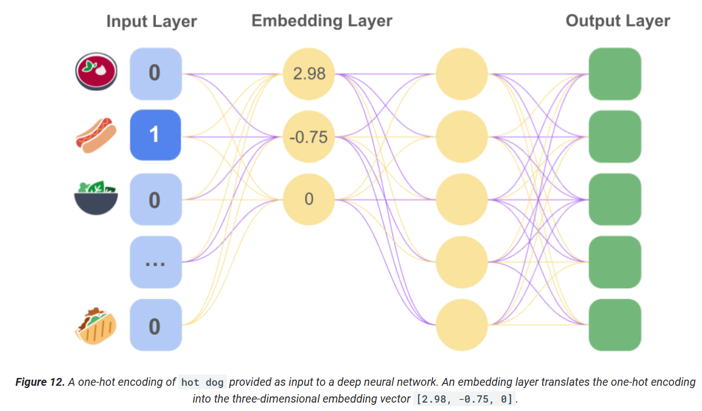

# Embeddings

When data is not numeric and has a lot of categories, we can use __one-hot__ encoding. For example, for 5000 food items, we would use a vector of length of 5000.

There are 2 problems with this approach:
- number of weights: the model needs more compute power, might not run on common hardware and requires more data to train properly
- lack of meaningful relations between vectors

An __embedding__ is a relatively low-dimensional space into which you can translate high-dimensional vectors.
An embedding captures some of the semantics of the input by placing inputs that are more similar in meaning closer together in the embedding space. An embedding represents each item in n-dimensional space with n floating-point numbers (typically in the range –1 to 1 or 0 to 1).

You can create an __embedding__ while training a neural network for your target task. This approach gets you an embedding well customized for your particular system, but may take longer than training the embedding separately. In general, you can create a __hidden layer__ of size d in your neural network that is designated as the embedding layer, where d represents both the number of nodes in the hidden layer and the number of dimensions in the embedding space.

For example, for a food recommendation example, our goal is to predict new meals a user will like based on their current favorite meals. First, we can compile additional data on our users' top five favorite foods. Then, we can model this task as a supervised learning problem. We set four of these top five foods to be feature data, and then randomly set aside the fifth food as the positive label that our model aims to predict, optimizing the model's predictions using a softmax loss. There is no activation function on the embedding layer.

Embeddings will usually be specific to the task, and will differ from each other when the task differs. For example, the embeddings generated by a vegetarian vs. non-vegetarian classification model might have two dimensions: meat content and dairy content. Meanwhile, the embeddings generated by a breakfast vs. dinner classifier for American cuisine might have slightly different dimensions: calorie content, grain content, and meat content. "Cereal" and "egg and bacon sandwich" might be close together in the embedding space of a breakfast vs. dinner classifier but far apart in the embedding space of a vegetarian vs. non-vegetarian classifier.

__Word2vec__ is one of many algorithms used for training word embeddings. It relies on the distributional hypothesis to map semantically similar words to geometrically close embedding vectors.
- N input nodes, where N is the number of words in our vocabulary
- M nodes in embeddings layer, based on how many dimensions we want
- anohter hidden layer with activation function
- another hidden layer with N nodes
- output layer with N nodes and softmax function. The output will be the most semantically closed word for the intput word
- to train this model, we would use (input, output) pairs of similar words: (sail, how), (sail, to), (sail, ship), etc
- the weights from the embedding layer would represent the embedding vector

One limitation of word embeddings is that they are __static__. Each word is represented by a single point in vector space, even though it may have a variety of different meanings, depending on how it is used in a sentence (ex: orange as color or fruit). __Contextual embeddings__ allow for multiple representations of the same word, each incorporating information about the context in which the word is used.