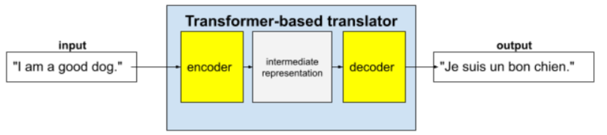
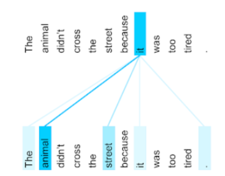
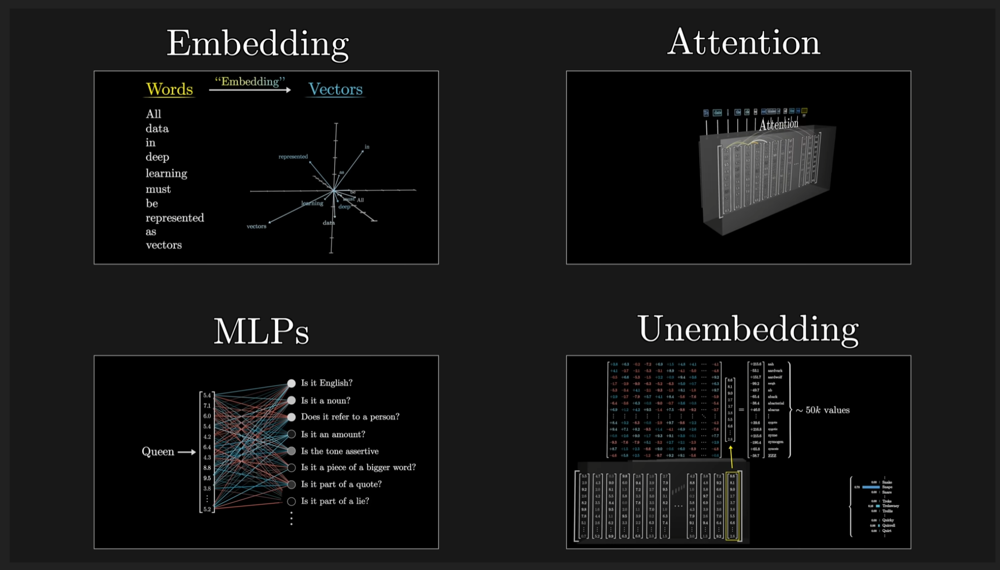
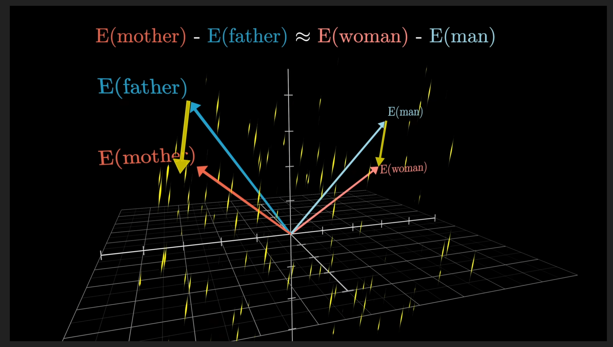
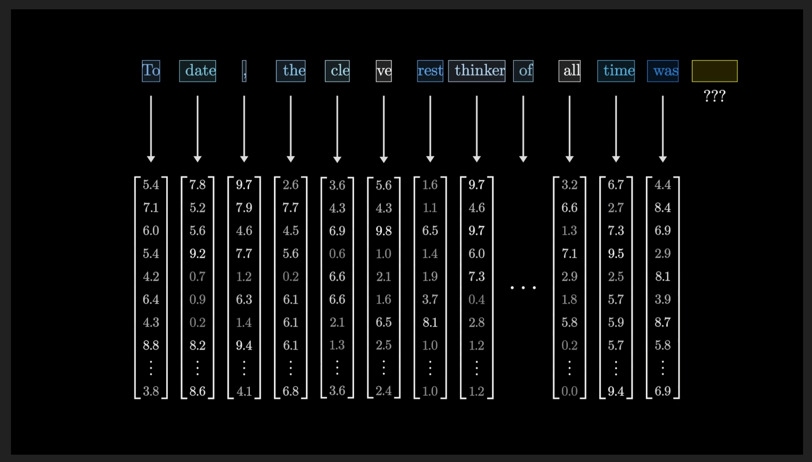
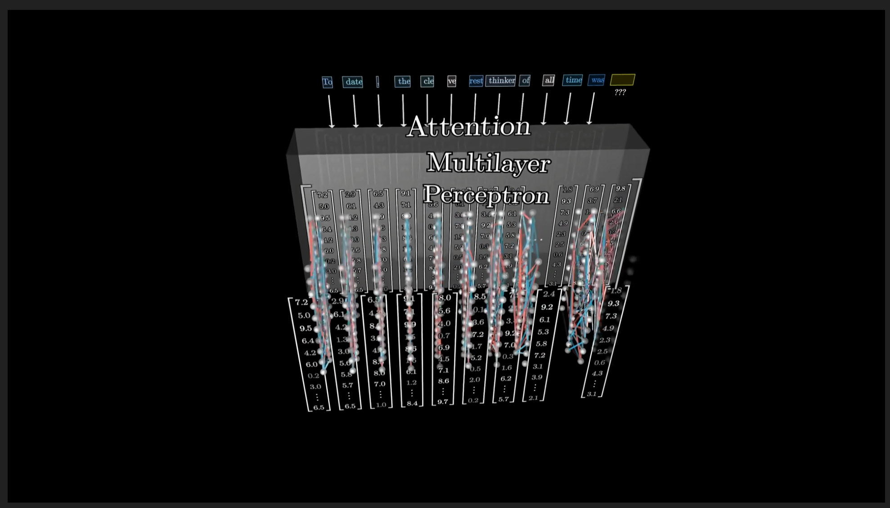
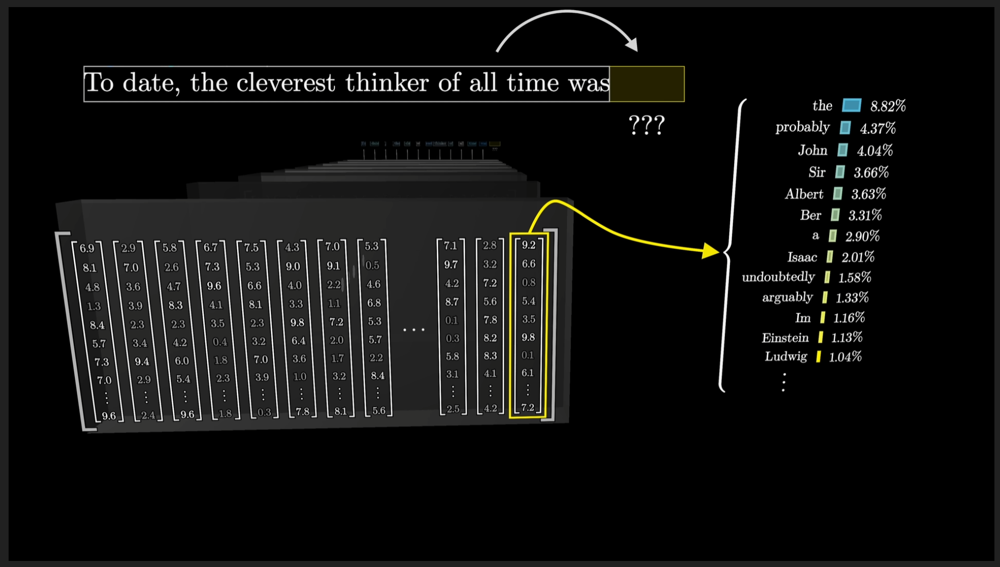

# Large language models

## Language models

A __language model__ estimates the probability of a token or sequence of tokens occurring within a longer sequence of tokens. A token could be a word, a subword (a subset of a word), or even a single character.

__Tokens__ are the atomic unit or smallest unit of language modeling. For example, the word unwatched might be represented by the following three subwords:
- un (the prefix)
- watch (the root)
- ed (the suffix)

There are a few other language models:
- __n-gram__ that use ordered sequences of words. Ex: 3 -grams "you are very", "are very nice". __Context__ is limited to the words from the n-gram
- __recurrent neural networks__ have better __context__ since they gain context from the passage or several sentences through the neural network. Recurrent neural networks evaluate information "token by token." In contrast, __large language models__ can evaluate the whole context at once.

## Large language models

__LLMs__ predict a token or sequence of tokens, sometimes many paragraphs worth of predicted tokens.

__Transformers__ are the state-of-the-art architecture for a wide variety of language model applications, such as translation.
Full transformers consist of an encoder and a decoder:
- An __encoder__ converts input text into an intermediate representation. An encoder is an enormous neural net.
- A __decoder__ converts that intermediate representation into useful text. A decoder is also an enormous neural net.

To enhance context, Transformers rely heavily on a concept called __self-attention__. Effectively, on behalf of each token of input, self-attention asks the following question:

"How much does each other token of input affect the interpretation of this token?"

Consider the following sentence: _The animal didn't cross the street because it was too tired._

The self-attention mechanism determines the relevance of each nearby word to the pronoun it.

Some self-attention mechanisms are __bidirectional__, meaning that they calculate relevance scores for tokens preceding and following the word being attended to.  By contrast, a __unidirectional__ self-attention mechanism can only gather context from words on one side of the word being attended to. 

Since each __self-attention layer__ is initialized to random values, different heads can learn different relationships between each word being attended to and the nearby words. For example, the self-attention layer described in the previous section focused on determining which noun the pronoun it referred to. However, other self-attention layers might learn the grammatical relevance of each word to every other word, or learn other interactions.

__Training__ an LLM requires huge compute power. During __inference__, they can hallucinate, exhibit bias, etc.

Other important LLM techniques: 
- __fine-tunning__: use a base LLM and train it with some task specific dataset. Fine-tunning does not change the number of parameters of the model
- __distilation__: creates a smaller version of an LLM, but the new model will not perform as well as the original model
- __prompt engineering__: enables an LLM's end users to customize the model's output. Showing one example to an LLM is called __one-shot prompting__. 

## Inside GPT 3

There are a few steps involved in GPT architecture

Every word / token is converted into a vector(~ 12k dimensions). There are ~ 50K tokens used in GPT-3. The __context__ size is 2048 tokens.

Tokens that relate to one another tend to be close in that multi dimensional space. Some directions in this space can be interpreted as a __meaning__. Ex, there seems to be a direction around gender:

After that, these vectors travel through an __attention layer__, where the values from each vector can influence each other depending on context. Some words relate to one another more than others.

Next step is a __multilayer perceptron__ that executes changes in parallel for each embedding. They seem to address very specific questions: "Is it a noun?", "Is it a lie?".

There are multiple attention blocks and mlp blocks.

In the end, only the last vector, will be interpreted as the next potential word. Depending on the __temperature__ setting, the word with the highest probability is chosen or not.

GPT-3 has ~ 175 billion parameters that are actuall wights and biases from all the layers presented above.

