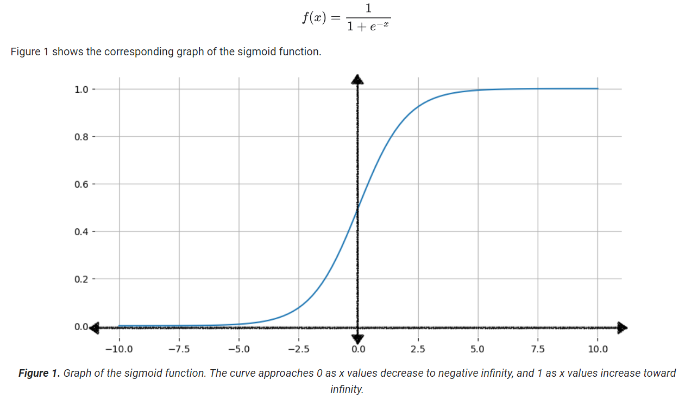
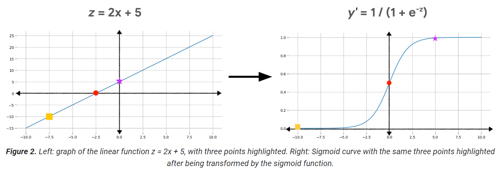
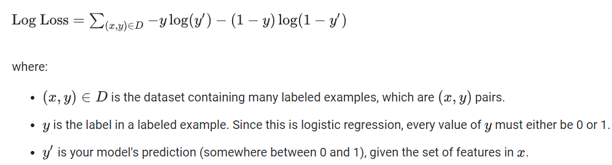

# Logistic Regression

 __Logistic regression__ is designed to predict the probability of a given outcome: "Will it rain today?" or "Is this email spam?"

 ## Sigmoid function

 

 To transform the linear output using sigmoid function, we do the following:
 - z = b + $w_1$*$x_1$ + $w_2$*$x_2$ + ... + $w_N$*$x_N$
 - y' = $\frac{1}{1 - e^{-z}}$

 

 ## Loss and regularization
 Logistic regression models are trained using the same process as linear regression models, with two key distinctions:
- Logistic regression models use __Log Loss__ as the loss function instead of squared loss.
- Applying __regularization__ is critical to prevent overfitting.

