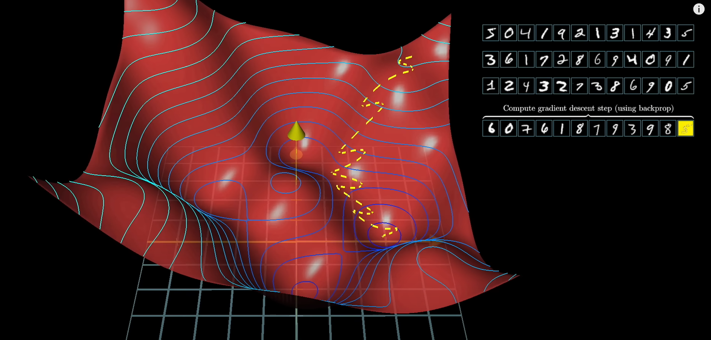

# Neural networks

 __Neural networks__ are a family of model architectures designed to find nonlinear patterns in data. During training of a neural network, the model automatically learns the optimal __feature crosses__ to perform on the input data to minimize loss.

 Additional layers between the __input layer__ and the __output layer__ are called __hidden layers__, and the __nodes__ in these layers are called __neurons__.

 Adding hidden layers to a network is not enought to represent nonlinearities. We need to introduce an __activation function__ (mathematical function), like sigmoid, tanh, ReLU, etc. in each layer.
 Sigmoid produces an output between 0 amd 1. Tanh produces an output between -1 and 1. ReLU produces max(0, x).

In practice, any mathematical function can serve as an activation function. $\sigma(wx+b)$

__Backpropagation__ is the most common training algorithm for neural networks. It makes gradient descent feasible for multi-layer neural networks. It tries to figure out how all weights and biases from all neurons should be modified to get to the minimum of the loss function.

Note that certain weights have a greater influence on the cost function result, because they are multiplied with activation values which are higher

The step above has to be done for all the neurons.

Calculating this __gradient descent__ for each input is expensive. Generally training dataset is split into minibatches and the calculation is done for each minibatch, eventually getting to that minimum.

## Vanishing Gradients

The gradients for the lower neural network layers (those closer to the input layer) can become very small.
When the gradient values approach 0 for the lower layers, the gradients are said to "vanish". Layers with vanishing gradients train very slowly, or not at all.

## Exploding Gradients
If the weights in a network are very large, then the gradients for the lower layers involve products of many large terms. In this case you can have exploding gradients: gradients that get too large to converge.

## Dead ReLU Units
Once the weighted sum for a ReLU unit falls below 0, the ReLU unit can get stuck. It outputs 0, contributing nothing to the network's output, and gradients can no longer flow through it during backpropagation. 

## Multi-class classification

__One-vs.-all__ provides a way to use binary classification for a series of yes or no predictions across multiple possible labels.

We could model it like this, but it can be inneficient for many classes:

Or we can use a deep neural network. Note that probabilities do not add to 1, because they are indpendent:

We can have probabilities that add to 1 using __softmax__ as an activation function. This is a __one vs one __ classification:

Softmax can be:
- __full softmax__ : calculate probabitlities for all the classes. It is expensive for a high number of classes
- __candidate sampling__ :  calculates a probability for all the positive labels but only for a random sample of negative labels
