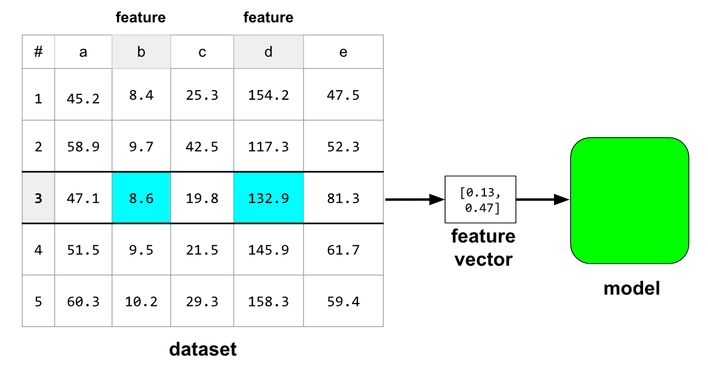
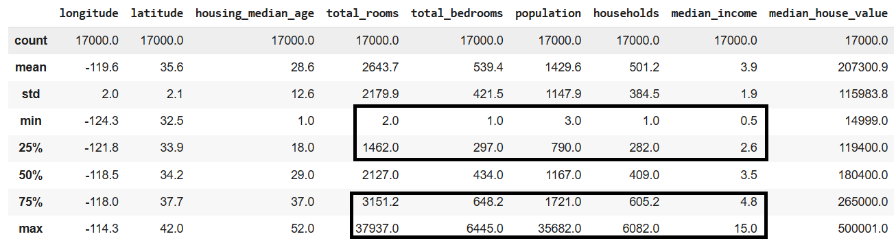
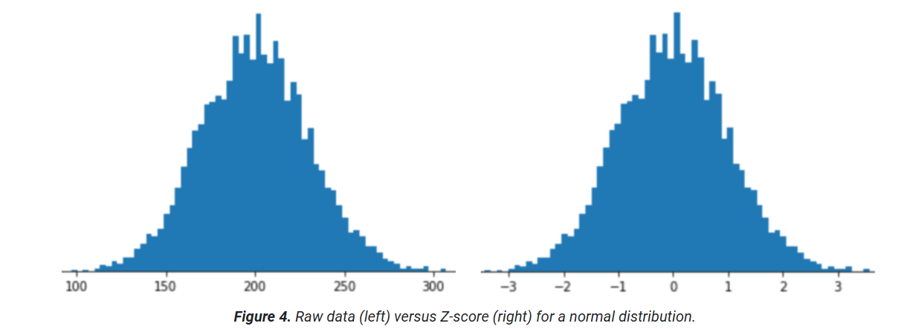
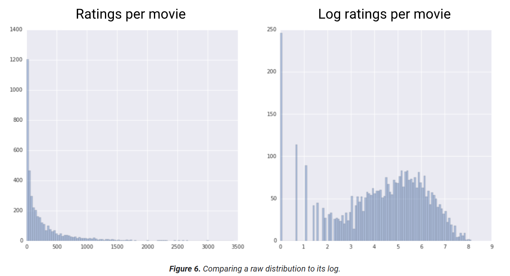
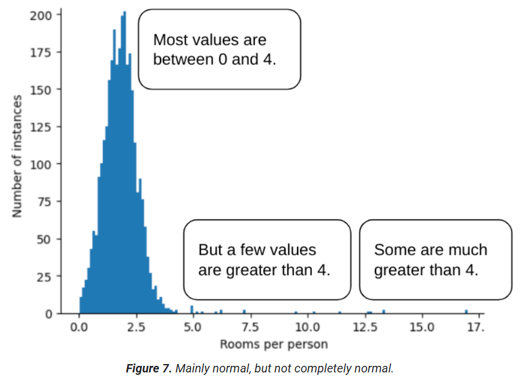
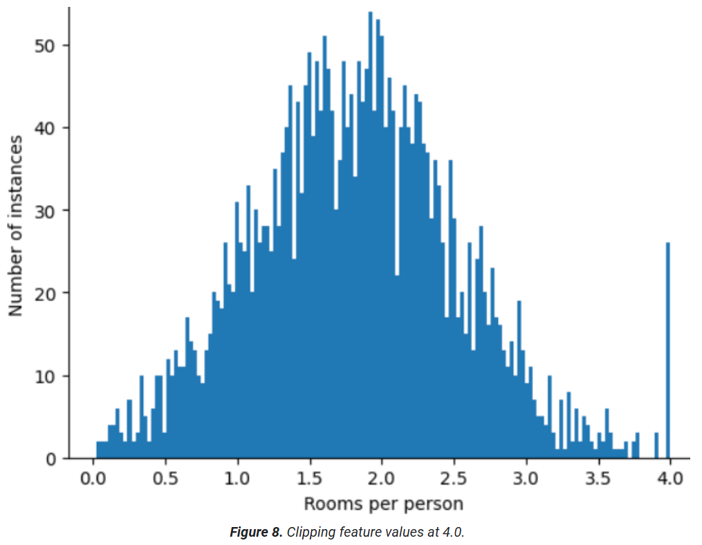
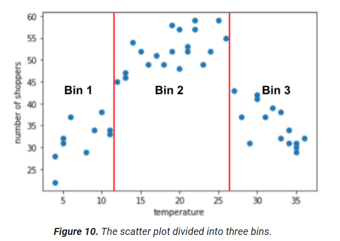
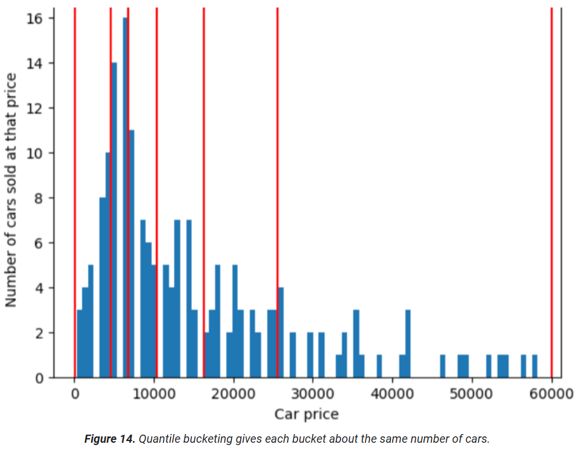
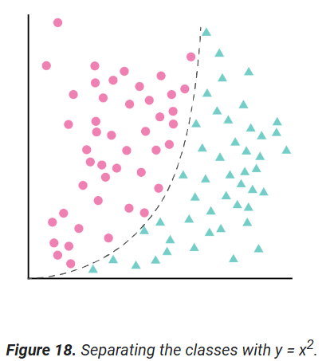

# Working with numerical data

## Overview

__Numberical data__ represents integers and float numbers. Ex: temperature, weight
__Categorical data__ represents categories. Ex: postal code, even if it could be a number

The model takes as input a __feature vector__. In most of the cases, it will not use the raw values, but other altered values. This process is called __feature engineering__.



The first steps in analyzing data:
- visualize your data using scatter plots or histograms
- statistically evaluate data: mean and median, standard deviation
- find outliers : when the delta between the 0th and 25th percentiles differs significantly from the delta between the 75th and 100th percentiles, the dataset probably contains outliers.



```python
import pandas as pd

# The following lines adjust the granularity of reporting.
pd.options.display.max_rows = 10
pd.options.display.float_format = "{:.1f}".format

training_df = pd.read_csv(filepath_or_buffer="https://download.mlcc.google.com/mledu-datasets/california_housing_train.csv")

training_df.describe()

```

```python
import pandas as pd
from matplotlib import pyplot as plt
import io

# The following lines adjust the granularity of reporting.
pd.options.display.max_rows = 10
pd.options.display.float_format = "{:.1f}".format

```

## Normalization

 The goal of __normalization_ is to transform features to be on a similar scale.

### Linear scaling

 __Linear scaling__ means converting floating-point values from their natural range into a standard range—usually 0 to 1 or -1 to +1. Age would be a good candidate for linear scaling.

 Linear scaling is a good choice when all of the following conditions are met:
- The lower and upper bounds of your data don't change much over time.
- The feature contains few or no outliers, and those outliers aren't extreme.
- The feature is approximately uniformly distributed across its range. That is, a histogram would show roughly even bars for most values (__even distribution__).

### Z-score scaling

A __Z-score__ is the number of standard deviations a value is from the mean. Z-score is a good choice when the data follows a __normal distribution__.



### Log scaling

__Log scaling__ computes the logarithm of the raw value, generally using natural logarithm ln. Log scaling is helpful when the data conforms to a __power law distribution__.



### Clipping 

__Clipping__ is a technique to minimize the influence of extreme outliers. In brief, clipping usually caps (reduces) the value of outliers to a specific maximum value. 




## Binning

__Binning__ (also called bucketing) is a feature engineering technique that groups different numerical subranges into bins or buckets.

Binning is a good alternative to scaling or clipping when either of the following conditions is met:
- The overall linear relationship between the feature and the label is weak or nonexistent.
- When the feature values are clustered.



__Quantile Bucketing__ creates bucketing boundaries such that the number of examples in each bucket is exactly or nearly equal.


## Scrubbing

__Scrubbing__ is the process of removing / fixing problems in data: omitted values, duplicates, out-of-range feature values, bad labels.

## Polynomial transform

Sometimes, when the ML practitioner has domain knowledge suggesting that one variable is related to the square, cube, or other power of another variable, it's useful to create a __synthetic feature__ from one of the existing numerical features.



We still can use linear regression and use both the original feature and the syntetic one.

$y = b + w_1x_1 + w_2x_2$ => $y = b + w_1x + w_2x^2$