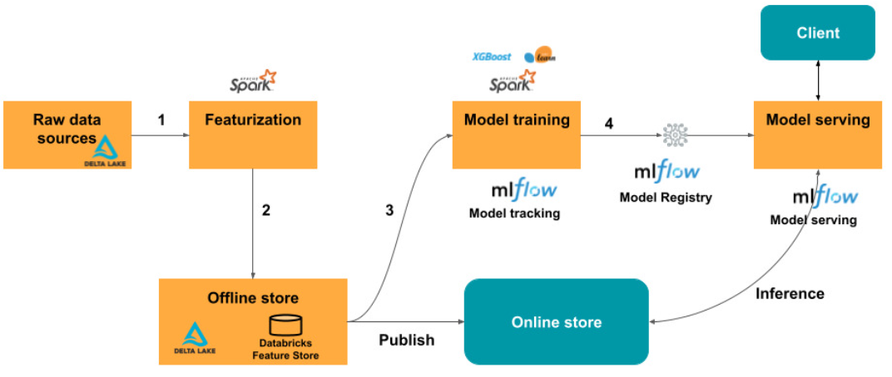

# Production ML Systems

You can train a model in either of two ways:
- __Static training__ (also called offline training) means that you train a model only once. You then serve that same trained model for a while.
- __Dynamic training__ (also called online training) means that you train a model continuously or at least frequently. You usually serve the most recently trained model.

A model can infer predictions in one of two ways:
- __Static inference__ (also called offline inference or batch inference) means the model makes predictions on a bunch of common unlabeled examples and then caches those predictions somewhere.
- __Dynamic inference__ (also called online inference or real-time inference) means that the model only makes predictions on demand, for example, when a client requests a prediction.

You can perform feature engineering during either of the following two periods:
- _Before_ training the model. Write code or use specialized tools to transform the raw data.
- _While_ training the model. In this approach, the transformation is part of the model code. The model ingests raw data and transforms it.

When you want to deploy a new version of the model:
- Test model updates with reproducible training. Seed your random number generators and use invariant hash keys to split the dataset deterministicly. 
- Test calls to machine learning API
- Write integration tests for pipeline components
- Validate model quality before serving. Look for __sudden or slow degradation__
- Validate model-infrastructure compatibility before serving

In order to monitor a model:
- Write a data schema to validate raw data. Check for anomalies, unexpected values of categorical variables
- Write unit tests to validate feature engineering. Ex: All numeric features are scaled, for example, between 0 and 1, Outliers are handled, such as by scaling or clipping.
- Check metrics for important data slices. A model with great overall metrics might still make terrible predictions for certain situations.
- Check for training-serving skew. __Training-serving skew__ means your input data during training differs from your input data in serving.
- Check for label leakage. Label leakage means that your ground truth labels that you're trying to predict have inadvertently entered your training features. 
- Monitor model age throughout pipeline

Questions to ask about a model:
- Is each feature helpful?
- Is your data source reliable?
- Is your model part of a feedback loop? Sometimes a model can affect its own training data. For example, the results from some models, in turn, become (directly or indirectly) input features to that same model.

## MLOps Platforms

### Open Source (Build your own)

- Data Management and Feature Engineering:Feast, Hopsworks
- Experiment Tracking and Model Versioning: MLflow, DVC
- Model Deployment and Serving: Seldon Core, BentoML
- Model Monitoring: evidently.ai, Prometheus + Grafana
- Machine Learning Workflow Orchestration: Kubeflow

### Managed

#### AWS SageMaker

#### Databricks

## References

- [5 Best Open Source Tools to Build End-to-End MLOps Pipeline in 2024](https://www.qwak.com/post/mlops-pipeline-with-open-source-tools)
- [Open Source MLOps: Platforms, Frameworks and Tools](https://neptune.ai/blog/best-open-source-mlops-tools)
- [Managed MLOps Platforms](https://www.qwak.com/post/top-mlops-end-to-end)
- [End-to-End Machine Learning Project – AI, MLOp](https://www.youtube.com/watch?v=o6vbe5G7xNo)
